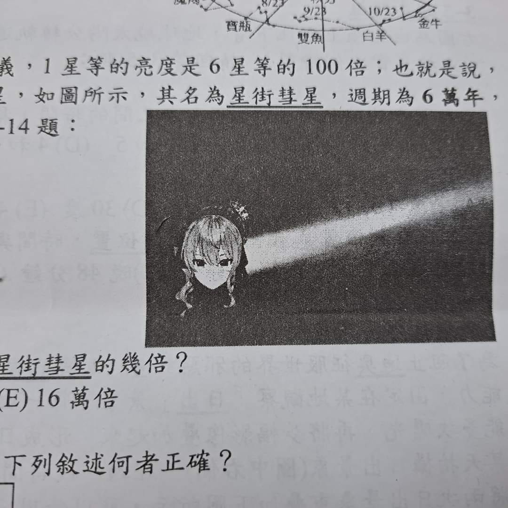

# PlurkReader
Reads Plurks off https://www.plurk.com/ (alpha)

## This is WIP
Does not read all plurks

## Background
I was to find the source of the following image

Seeing https://webcache.googleusercontent.com/search?q=cache:p5PwLgIdiqMJ:https://www.plurk.com/sheer2130&cd=30&hl=en&ct=clnk&gl=hk

I somehow thought the image was from 2020? So I thought to write a scraper for the site as the web UI does not allow jumping to a particular time. 
